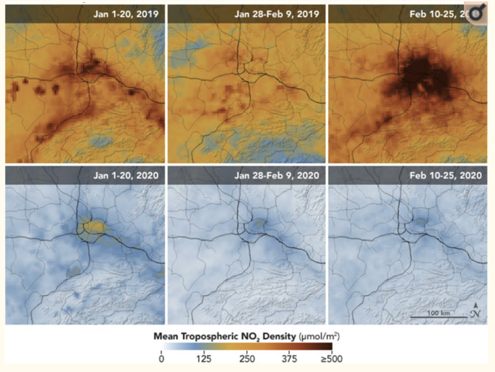

# Case Study: 2020 COVID19: Processing Nitrogen Dioxide Remote Sensing Data

## About this Digital Case Study

This is a **digital case study** built with [Jupyter Notebook](https://jupyter.org/) and Docker to support COVID 19 studies on reduction of pollution from national lockdowns. 

1. ScienceDaily News: [COVID-19 lockdowns significantly impacting global air quality](https://www.sciencedaily.com/releases/2020/05/200511124444.htm)
2. [Wu, X., Nethery, R.C., Sabath, B.M., Braun, D. and Dominici, F., 2020. Exposure to air pollution and COVID-19 mortality in the United States. medRxiv.](https://www.medrxiv.org/content/medrxiv/early/2020/04/27/2020.04.05.20054502.full.pdf)
3. [Dutheil, F., Baker, J. S., & Navel, V. (2020). COVID-19 as a factor influencing air pollution?. Environmental Pollution (Barking, Essex: 1987).](https://www.ncbi.nlm.nih.gov/pmc/articles/PMC7144597/)

Figure 1. Sequence of airborne NO2 concentrations measured with the TROPOMI sensor on-board ESA’s Sentinel-5 satellite before and after the COVID-19 pandemic (image source: #3 above). 

### Special Note
This advanced but introductory set of notebooks assumes a computing environment with at least 16GB of RAM, adequate internet bandwidth and 300GB of unused disk space. The NetDC4 files from the Sentinel 5P satellite are large-sized, each one about 400MB. For demonstration purposes, in Pipeline 1, 4 NetCD4 files (data for 1 day for African continent) are downloaded, then converted to Pandas DataFrames, which are also saved on file. In Pipeline 2, 8 weeks worth of data are downloaded (~105GB) for the African continent (~31 files per week), 4 weeks in 2019 and 4 weeks in 2020.

### Acknowledgements
Special thanks to the great folks behind the NASA Applied Remote Sensing Training (ARSET) for the easy-to-follow webinars on [NO2 remote sensing](https://arset.gsfc.nasa.gov/airquality/webinars/advanced-NO2-2019).

## License
The repository utilizes code licensed under the terms of the Apache Software
License and therefore is licensed under ASL v2 or later.

This source code in this repository is free: you can redistribute it and/or modify it under
the terms of the Apache Software License version 2, or (at your option) any
later version.

This source code in this repository is distributed in the hope that it will be useful, but WITHOUT ANY
WARRANTY; without even the implied warranty of MERCHANTABILITY or FITNESS FOR A
PARTICULAR PURPOSE. See the Apache Software License for more details.

You should have received a copy of the Apache Software License along with this
program. If not, see http://www.apache.org/licenses/LICENSE-2.0.html

The source code forked from other open source projects will inherit its license.

## Contributing
Anyone is encouraged to contribute to the repository by [forking](https://help.github.com/articles/fork-a-repo)
and submitting a pull request. (If you are new to GitHub, you might start with a
[basic tutorial](https://help.github.com/articles/set-up-git).) By contributing
to this project, you grant a world-wide, royalty-free, perpetual, irrevocable,
non-exclusive, transferable license to all users under the terms of the
[Apache Software License v2](http://www.apache.org/licenses/LICENSE-2.0.html) or
later.
